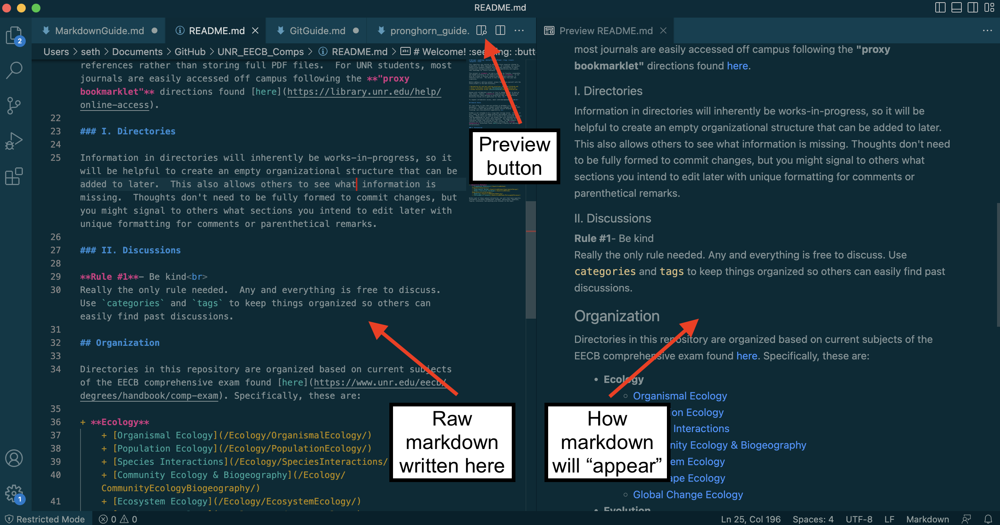

# Markdown Guide

Markdown is a language for adding fomatting elements to plain text files.   Basic markdown syntax is very simple, but you can get fancier by incorporating HTML or LaTex elements. While not the focus of this repo or this guide, it's worth pointing out that LaTex is a more thorough type-setting language that is used by professional journals to format publications.  While most scientists in our field still write manuscrips in Word, learning LaTex can be worth the effort. *TONS* of time is wasted re-formatting images, text, citations, etc. to meet the formatting standards that different journals require.  Markdown is a good intro to understanding how type-settting languages work, and getting familiar with them can be invaluable if you continue to work in science. 

Markdown formatting is written explicitly within your normal text, so it becomes much easier to write collaboratively, track formatting changes, and merge edits from multiple users. A few reasons why getting comfortable with markdown is worth the effort:

+ **Code embedding** - particularly useful for documenting and organizing statistical analyses and workflows
+ **Sharing your work** - Markdown is rendered to HTML which can be published to 

## Writing/Editing/Viewing
Basic markdown elements will be rendered consistently on any platform, but more complex elements may or may not appear depending on the editor or interpreter you use.  For interacting with markdown files in this repo, I would recommmed using [VS  Code](https://code.visualstudio.com/download).

VScode is a great code editor for any langauge and is widely used. VScode does a great job with syntax highlighting (i.e. auto-coloring unique elements) and allows you to preview your formatting in real-time. 

 
 

GitHub has its own markdown interpreter, so you can view rendered text files directly in your browser.  Links (relative, local, or online) all work in the native Git interpreter, so reading and moving between files is easy.  If you are doing any editing or writing, you should *always* do this in a local (i.e. on your own computer) text editor.  While you *can* edit files directly on GitHub, I would not recommend this as good practice.

**NOTE:** **While HTML is common for adding more complex formatting in markdown (and is rendered by most interpreters), the GitHub interpretor will strip most of these elements and they will not show up.  For instance, if you view this file in VScode, "NOTE:" will appear in red, but it will be normal text color on GitHub.** 
 

## I. Organizational formatting

If you're going from a program like Word to markdown, the first thing to get used to is that spaces, indents, and line breaks are collapsed to a spacing standard.  You must explicitly add spacing or line break elements to customize.

Adding extra spaces/lines via  of these *will* appear in raw text, but *not* in rendered markdown. Excess spacing is good practice for keepin raw code readable, but keep in mind that they will be collapsed to the following:  

### **Spacing standards**

&emsp; multiple <kbd>**Enter**</kbd> = single line break 
&emsp; in-line multiple <kbd>**Space**</kbd> = single space 
&emsp; end-of-line double <kbd>**Space**</kbd> = single line break

### **Line breaks**
Double <kbd>Space</kbd> at the end of lines is common for making new lines, but these are invisible when looking at raw text. I use them depending on the context. Using explicit elements can be good practice to make your raw text easier to read and debug. 
&emsp; ` ` = single line break  
&emsp; `
` = a horizontal rule like below (helps visually seperate sections)

### **Whitespaces**
&emsp; `&nbsp;` = single white space like &nbsp; here  
&emsp; `&ensp;` = double white space like &ensp; here  
&emsp; `&emsp;` = quadruples white space (tab) like &emsp; here 
 

## II. Text formatting

### **Headers (leading hashtags)**
# &ensp; # Header (auto-generates a horizontal rule)
## &ensp;&nbsp; ## Header
### &emsp; ### Header
#### &emsp;&nbsp; #### Header

### **Emphasis (surround with asterisks)** 
&emsp; `*text*` = *italics*  
&emsp; `**text**` = **bold**  
&emsp; `***text***` = ***bold and italicized***  

### **Text coloring (HTML, **not rendered on GitHub**)**
I mostly use HTML  to color text or highlight, but you need to be reading a file in VScode or some other HTML compatible text editor to view these.  Most markdown editors do some partial rendering of HTML but can't handle certain blocking elements like `<body>`.  You can experiment to find what works.  I typically use combinations of `
` and `` for multi-line and in-line formatting respectively.

### **In-line styles with ``**
These follow the format of:
    
    text

&emsp; `span` = indicates *start* of an in-line formatting element 
&emsp; `/span` = indicates *end* of an in-line formatting element 
&emsp; `style` = usually doesn't change, indicates a class of formatting we will use 
&emsp; `element` = replace with the formatting element you want - options include: 
&emsp; &emsp; &emsp; `color` = color of the text 
&emsp; &emsp; &emsp; `background-color` = highlight color 
&emsp; &emsp; &emsp; `size` = size of text 
&emsp; &emsp; &emsp; `font` = font of text 
&emsp; `attribute` = replace with the value of the element 
&emsp; &emsp; &emsp; For custom colors, look [here]() and copy the corresponding values from the top of the picker 
&emsp; &emsp; &emsp; `color_name` see options [here](link) 
&emsp; &emsp; &emsp; `rgb(x,y,z)` for RGB values x, y, and z  
&emsp; &emsp; &emsp; `rgba(x,y,z,a)` for RGB values x,y, and z and alpha/transparency value a 
&emsp; &emsp; &emsp; `#xxxxxx` for hex color codes 
&emsp; `text` = the text that will be formatted 

For example, if you view this file in VScode, this text will be tomato color and this text will be highlighted yellow. 

### **Multi-line styles with `
`**
You can put as much text as you want between `` and ``.  However, only lines with text will be formatted.  If you want to have continuous formatting across multiple paragraphs, use `
` (stands for division).  In using `
`, it's best to include thse tags as new lines for code readability like this

    

    This text in the first paragraph will be highlighted green. 
     
    This text in a second paragraph will also be highlighted green, and the highlight will be continuous across the blank line in between.
    

View the example below in VScode:

Paragraph one to be highlighted in green 
 
Second paragraph to be highlighted in green.

## III. Linking

## IV. Image/Code embedding

## V. Equations

adelder@mines.edu